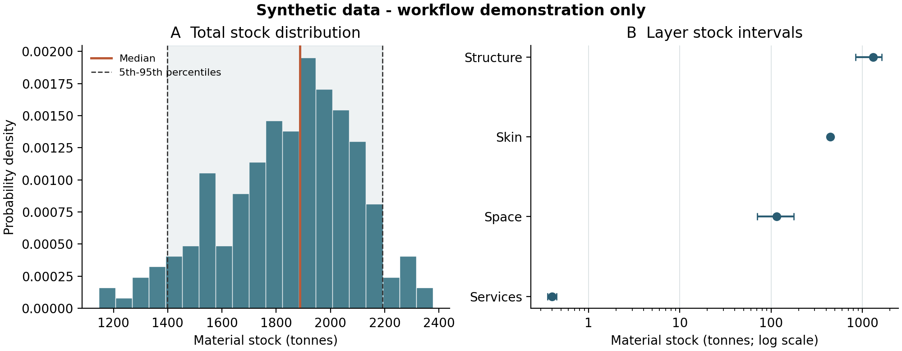

# Synthetic minimal working example

A small, self-contained example of the uncertainty-aware building material
stock workflow. It reuses the study's conditional DSDS models, age/prototype
sampling and component-dimension conversion, with entirely synthetic inputs
and the original material-pool scheduling convention.

The purpose is to let readers run and test the software without access to the
Bristol building records, survey observations or original HMI database.
The generated results are illustrative and are not empirical validation of
the Bristol estimates or of the assumed age probabilities.

## Quick start

Use **Python 3.11**. From this directory:

```bash
python3.11 -m venv .venv
source .venv/bin/activate
python -m pip install -r requirements-lock.txt
python run_example.py
python verify_example.py
python -m unittest discover -s tests -v
```

`requirements-lock.txt` records all dependencies from the clean test environment;
`requirements.txt` lists the five direct dependencies separately.
On Windows, activate the environment with `.venv\Scripts\activate` instead.
Runtime depends on hardware; see the verified record in
[TESTED_ENVIRONMENT.md](TESTED_ENVIRONMENT.md). No GIS software, network service, API key or
external data download is required after installing the Python dependencies.

The entire `synthetic` directory can also be copied outside this repository.
Input and default output paths resolve relative to `run_example.py`, so the
runner can be invoked from a different working directory. Unit-test discovery
in the command above is run from the example directory.

## Included data and default settings

| Input or setting | Default |
| --- | --- |
| Buildings | 24 fictional houses, including one-, two- and three-storey buildings |
| Areas | Two fictional neighbourhoods, 12 buildings each |
| Age cohorts | `<1920`, `1960-1980`, `2002-2006` |
| DSDS fitting data | 300 generated observations; the existing 80/20 split is retained |
| HMI | 53 synthetic component/material rows across four building layers |
| Monte Carlo draws, `K` | 200 |
| Candidates per shared prototype pool, `P` | 5 |
| Pool refresh blocks, `C` | 10, hence 20 draws per block |
| Base simulation seed, `--seed` | 42 |
| Shared wall seed, `--wall-seed` | 43 |

See [data/README.md](data/README.md) for column definitions and units. All four
CSV input files are included and can be regenerated with:

```bash
python generate_data.py --output regenerated_data
```

The fixture-generation seed is separate from the Monte Carlo seed. The
synthetic coefficients, age probabilities and training observations were
created for this example; they are not estimates extracted from the study.

## What the example runs

1. Fit the DSDS conditional Poisson models for rooms, windows and doors, and
   the conditional lognormal internal-wall-length model, to synthetic data.
2. Sample construction ages using the supplied conditional probability matrix.
   The CSV has **sampled ages in rows and recorded ages in columns**; each
   column sums to one. The runner transposes it for the original sampler API.
3. Build age-eligible material trees, apply the original exterior-attribute
   trimming rules and sample technology/specification alternatives. All
   materials belonging to a selected specification remain together.
4. Reuse a pool of `P` candidates within each area, sampled-age, exterior
   prototype and refresh-block combination. Each exterior prototype includes
   wall material, roof material and roof shape. Age and candidate-index slots
   follow the shared area-seeded schedule described below.
5. Convert component intensities to masses using the original dimensional
   conversion. Deep-copy each selected tree before applying building dimensions.
6. Sum aligned building draws into area and city sequences. Aggregation uses
   the union of **all** material-path columns, preserving materials absent from
   the first building. Compute layer/material summaries, percentiles and a figure.

### Original random scheduling

| Random operation | Seed convention |
| --- | --- |
| Area base seed | `--seed` plus the area's zero-based order of first appearance in `buildings.csv` |
| Candidate pool in block `b` | `area_seed + b`, the same seed for every age and exterior prototype |
| Age and candidate-index slots | Constant `area_seed`, restarted for every building and block |
| Building count draws | Stable hash of the base seed, `counts` and building ID |
| Shared wall factor | Seed 43 by default, restarted for every building |

First-appearance area order replaces the historical dependence on unsorted
filesystem enumeration. The actual area-to-seed mapping is recorded with the
run. Reordering the first appearance of areas can change results unless an
explicit mapping is supplied through `--area-seeds`.

Within an area, buildings with the same recorded age share sampled-age and
candidate-index sequences. These slots repeat across refresh blocks while
the candidate pools refresh. Identical candidate indices can represent
different constructions for different exterior prototypes. This sharing
preserves the original material schedule; it is not independent material
sampling for every building.

Count draws use separate reproducible streams for each building. The original
Poisson helper constructed unseeded generators, so a seed alone cannot recover
its historical count draws. Explicit streams retain the conditional model
distributions while making new runs reproducible.

Internal-wall lengths use the **same standardised random factor across
buildings** on each draw. Their absolute lengths differ with conditional
means and sampled counts. The default wall seed 43 preserves the original
DSDS convention (`random_state=42`, plus one). Changing `--seed` does not
change this wall stream; `--wall-seed` is a separate sensitivity option.

This is a serial, in-memory orchestration of the research primitives, suitable
for the small fixture. It does not reproduce the production disk-backed and
parallel execution system. Numeric MI coefficients are supported here; the
small services inventory covers wiring and ventilation. The original trimmer's
preference for Skin wall filtering is retained. See
[CODE_ORIGIN.md](CODE_ORIGIN.md) for the source/adaptation record. Strict
synthetic-input validation is retained. Raw research data requiring legacy
handling need an explicit external adapter; this CLI does not silently
accept those exceptions.

## Outputs and checks

`outputs/` is generated locally and ignored by Git. For every run, use a new or
empty output directory so that files from different configurations cannot mix.

| Output | Contents |
| --- | --- |
| `draws/buildings/`, `draws/areas/`, `draws/city_paths.csv.gz` | Paired draw sequences for every six-level material path, in kg |
| `building_targets.csv.gz`, `area_targets.csv.gz`, `city_targets.csv` | Total mass, four layers and seven material groups by draw, in kg |
| `summary.csv` | Mean, median and 5th/95th percentiles for each building, area and city target |
| `draw_metadata.csv.gz` | Sampled ages, DSDS quantities, refresh blocks and shared wall factor |
| `pool_inventory.csv` | Pool identities, request counts and candidate fingerprints |
| `checks.json`, `run_metadata.json` | Conservation checks, settings, actual seeds, input hashes and software versions |
| `synthetic_results.png`, `synthetic_results.pdf` | Total-stock distribution and layer intervals |

Layer totals and material totals are two separate partitions of total mass;
do not sum all target columns together. Material reporting follows the
original Figure 3 terminal-name rules, with unmatched names assigned to
`Other`. The exact treatment of bare `Timber`, boards and slate is documented
in [data/README.md](data/README.md) and tested in `tests/test_aggregation.py`.

`verify_example.py` checks saved-output integrity and mass conservation. For
the supplied inputs and default settings, it also compares city summaries
with [expected/default_city_summary.csv](expected/default_city_summary.csv),
allowing small floating-point differences. The reference values are a
software regression baseline, not measured material stocks. The expected files
belong to this original-schedule revision and supersede the earlier
per-building material-seed baseline.

The unit tests cover a hand-calculated component inventory, multi-material
specification retention, age-matrix direction, shared wall randomness,
the original pool/slot schedule, pool copying/reuse, repeatability, and aggregation when a later building
introduces a material column absent from the first building. Agreement with
a research-code calculation checks software behaviour; it does not establish
predictive accuracy against observed building inventories.

## Changing the run

```bash
python run_example.py --draws 100 --pool-size 3 --refreshes 5 --seed 123 --output outputs_trial
python verify_example.py --output outputs_trial
```

`K` must be divisible by `C`; `P` is independent of that divisibility rule.
Use `--no-plot` to omit figures or `--input-dir` to supply another directory
with the four input CSVs. Modified inputs/settings are checked for integrity
but are not compared with the default numerical reference. The 200-draw
default is chosen for a quick demonstration, not as a convergence criterion.

For explicit area seeds, save a complete area-to-integer mapping as JSON:

```json
{"synthetic_area_A": 42, "synthetic_area_B": 43}
```

```bash
python run_example.py --area-seeds area_seeds.json --output outputs_explicit
python run_example.py --wall-seed 44 --output outputs_wall_sensitivity
```

An explicit mapping can preserve an identified historical area seed in a
local research replay. It cannot reconstruct the original unseeded count
draws. A fresh fully sampled run is therefore not promised to match historical
outputs bit for bit, even when the material schedule matches.

## Example figure



Panel A shows the distribution of total synthetic city stock, with its median
(solid line) and 5th/95th percentiles (dashed lines). In Panel B, dots show
layer medians and horizontal bars show the 5th--95th percentile range, on a
logarithmic mass axis. These are simulated output intervals, not confidence
intervals on measured stocks. All figure masses are in tonnes.

See [TESTED_ENVIRONMENT.md](TESTED_ENVIRONMENT.md) for execution checks and
[provenance.json](provenance.json) for source-code fingerprints.

A separate local check of the revised sampling helpers on retained real
inputs is summarised in [REAL_DATA_CHECK.md](REAL_DATA_CHECK.md).
